# 论坛-Bubble 世界观与系统草案

> 目标：把现在偏“一次性 prompt 生成”的论坛与 Bubble，逐步升级成一个有历史、有角色、有情绪连续性的轻量世界系统。

## 1. 当前项目现状

### 1.1 论坛现状

- 入口主要是 `discussion.html` + `app.js`。
- 论坛配置存在 `x_style_generator_settings_v2`，其中自定义页签已经包含：
  - 页签名称；
  - 活跃用户定位；
  - 页签文本 / 长期讨论背景；
  - 当前热点；
  - 时间感知；
  - 世界书挂载；
  - Bubble 关注挂载；
  - 论坛个人主页 / 转发挂载。
- 主贴缓存存在 `x_style_generator_posts_v2`。
- 个人主页帖子存在 `x_style_generator_profile_posts_v1`。
- 回复树缓存存在 `x_style_generator_discussions_v1`。
- 当前发帖生成逻辑是：读取论坛世界观、当前页签设定、热点、挂载语境、近期缓存帖子去重提示，然后一次性生成一组帖子。
- 当前回复生成逻辑是：读取主楼 / 上一层回复、论坛设定、热点、作者人设，然后一次性生成一组回复。
- 当前“回复用户”不是持久角色：`displayName` / `handle` 来自模型输出或前端兜底，不会在下一次生成中被稳定复用。

### 1.2 Bubble 现状

- 入口主要是 `bubble.html` + `bubble.js`。
- Bubble 房间存在 `x_style_generator_bubble_rooms_v1`。
- Bubble 聊天消息存在 `x_style_generator_bubble_threads_v1`。
- Bubble 粉丝详情存在 `x_style_generator_bubble_fan_details_v1`。
- 用户发送的 Bubble 消息已经在本地保留历史。
- 用户发送消息后，会先生成 3 个粉丝卡片占位；点击粉丝详情时才调用模型生成粉丝回复。
- 当前粉丝回复输出字段只有 `language` 和 `text`，前端再随机生成 `fanId` / 头像。
- 当前 Bubble 粉丝也不是持久角色：同一个粉丝不会带着之前的记忆、情绪或论坛行为回来。

### 1.3 论坛与 Bubble 的现有互通

- 论坛页签可以挂载最近一轮 Bubble 消息：如果 Bubble 最近消息落在时间窗内，论坛生成会把它当成即时爆点。
- Bubble 可以挂载论坛自定义页签：可选择页签文本和页签热点作为粉丝回复的辅助背景。
- 这两种互通目前都是“prompt 挂载”，不是数据库层面的事件或角色联动。

### 1.4 后端与数据库现状

- 后端是 `server/src/index.js`，提供静态页面和 Neon/Postgres 存储 API。
- 已有 `storage_records`，用于保存浏览器 localStorage 快照。
- 已有较结构化的业务表：例如 `app_settings`、`app_profiles`、`chat_contacts`、`chat_conversations`、`chat_messages`、`worldbook_*`、`memory_*`。
- 论坛、Bubble、plot 等目前主要作为 `app_documents` 的 JSON 文档镜像，而不是独立业务表。
- 当前云端上传主要通过首页的“上传当前本地缓存到云端数据库”触发；论坛和 Bubble 页面自身并没有把每次发送 / 生成动作直接写入数据库。

## 2. 这次优化想解决的问题

### 2.1 内容层问题

- 论坛主贴和回复都是单次生成，缺少长期演化。
- Bubble 粉丝回复基于单轮消息，缺少粉丝群体的连续性。
- 论坛用户 / Bubble 粉丝没有稳定身份，只像“临时群众演员”。
- 热点只是 prompt 文本，不会沉淀成后续角色认知或世界事件。
- 跨平台联动只停留在“把文本挂进去”，还没有“谁看到了什么、谁因此激动、谁后来去论坛发帖”的因果链。

### 2.2 数据层问题

- 当前前端 localStorage 已经能保存很多状态，但它更像 UI 缓存，不适合作为世界系统的唯一事实来源。
- 论坛和 Bubble 在数据库里还没有一套可查询、可扩展的结构化模型。
- 如果未来要让角色复用、记忆追加、跨平台追踪，就需要至少有事件、角色、消息 / 帖子之间的关联。

## 3. 世界观原则

### 3.1 同一个世界，两种表面

- 论坛是公开讨论场：更适合表现围观、争论、二创、阴阳怪气、猜测、复盘。
- Bubble 是创作者向粉丝发声的半私密场：更适合表现即时情绪、亲近感、粉丝滤镜、被“本人消息”刺激后的反应。
- 两边不是两个独立系统，而是同一个舆论世界的两个入口。

### 3.2 热点不是文本，而是事件

- 页签热点、用户论坛发帖、用户 Bubble 消息、爆发争论、某个角色被用户回应，都可以成为世界事件。
- 事件可以被不同角色以不同方式知道。
- 角色不应该天然知道所有历史；新热点之后生成的新角色，可以只知道“这个热点之后”的信息。

### 3.3 角色不是复杂记忆系统，而是轻量连续文本

- 论坛 / Bubble 的角色不需要像 Chat 角色那样做记忆衰退、召回、稳定性计算。
- 每个角色可以只有一段完整的 `persona_text` 和一段持续追加的 `memory_text`。
- 生成时直接把相关角色的完整文本喂给 prompt。
- 角色记忆可以被事件追加，例如：
  - “她是在某条 Bubble 消息爆发后出现的粉丝。”
  - “她之前在论坛骂过某个争议点。”
  - “用户疑似回复了她那条 Bubble 评论，她非常激动。”

### 3.4 匿名是前台表现，不等于后台没有身份

- Bubble 前台仍然可以显示匿名粉丝、随机 ID、头像 emoji。
- 后台可以把某条 Bubble 粉丝回复绑定到一个 `role_id`。
- 如果用户后续明显在回应这条粉丝回复，系统可以把它记录成该角色的事件。
- 该角色之后可以在论坛里以某种方式发帖或回复，比如“刚刚好像被本人看到了”。

## 4. 建议的核心数据模型

> 这里先写概念模型，不急着一次性全部落地。

### 4.1 世界事件：`world_events`

用于承载热点和跨平台因果。

建议字段：

- `id`：事件 ID。
- `source`：`forum` / `bubble` / `system` / `user`。
- `source_id`：来源对象 ID，例如帖子 ID、Bubble 消息 ID、粉丝回复 ID。
- `event_type`：事件类型，例如 `hot_topic_created`、`bubble_message_sent`、`forum_post_generated`、`fan_reply_generated`、`user_replied_to_fan`。
- `tab_id`：关联论坛页签，可为空。
- `topic_key`：热点或主题归一化 key。
- `title`：短标题。
- `summary_text`：给 prompt 用的事件摘要。
- `payload_jsonb`：保留原始上下文。
- `importance`：重要度。
- `occurred_at`：事件发生时间。
- `created_at` / `updated_at`：数据库时间。

### 4.2 世界角色：`world_characters`

用于承载论坛用户 / Bubble 粉丝 / 跨平台角色。

建议字段：

- `id`：角色 ID。
- `scope`：`forum` / `bubble` / `cross`。
- `origin_event_id`：角色从哪个事件或热点中诞生。
- `tab_id`：主要活跃的论坛页签。
- `display_name`：论坛显示名，可为空。
- `handle`：论坛 handle，可为空。
- `bubble_alias`：Bubble 匿名 ID 或别名，可为空。
- `avatar_text`：emoji 或短头像文本。
- `persona_text`：稳定角色文本。
- `memory_text`：持续追加的完整记忆文本。
- `emotion_text`：当前情绪状态文本，可选。
- `knowledge_boundary_text`：这个角色知道 / 不知道什么，例如“只知道某次热点之后的信息”。
- `status`：`active` / `quiet` / `archived`。
- `payload_jsonb`：保留扩展信息。
- `created_at` / `updated_at`。

### 4.3 论坛主贴：`forum_posts`

用于把论坛主贴从纯前端缓存升级为可追踪对象。

建议字段：

- `id`：帖子 ID。
- `tab_id`：所属页签。
- `author_character_id`：作者角色；用户本人发帖可为空或指向特殊 user actor。
- `author_owned`：是否用户本人。
- `text`：正文。
- `tags_jsonb`：标签。
- `repost_source_jsonb`：转发原帖快照。
- `metrics_jsonb`：浏览、赞、转发、回复等。
- `payload_jsonb`：兼容现有前端对象。
- `client_created_at`。
- `created_at` / `updated_at`。

### 4.4 论坛回复：`forum_replies`

用于让回复也能绑定角色和记忆。

建议字段：

- `id`：回复 ID。
- `post_id`：主贴 ID。
- `parent_reply_id`：楼中楼父回复，可为空。
- `author_character_id`：回复角色。
- `text`：回复文本。
- `metrics_jsonb`：赞、回复等。
- `payload_jsonb`：兼容现有前端对象。
- `client_created_at`。
- `created_at` / `updated_at`。

### 4.5 Bubble 消息：`bubble_messages`

用于把用户 Bubble 历史和粉丝回复统一到数据库。

建议字段：

- `id`：消息 ID。
- `room_id`：Bubble 房间。
- `sender_type`：`user` / `fan_placeholder` / `fan_reply`。
- `character_id`：粉丝角色，可为空。
- `parent_message_id`：对应用户消息或粉丝卡片。
- `detail_id`：兼容现有粉丝详情 ID。
- `batch_id`：一轮连续 Bubble 消息的批次 ID。
- `text`：正文；粉丝卡片占位可为空。
- `language`：粉丝回复语言，可为空。
- `payload_jsonb`：兼容现有前端对象。
- `client_created_at`。
- `created_at` / `updated_at`。

### 4.6 角色事件关系：`character_event_links`

用于记录“哪个角色知道 / 参与 / 被影响了哪个事件”。

建议字段：

- `character_id`。
- `event_id`。
- `relation_type`：`created_from` / `knows` / `reacted` / `mentioned` / `emotion_changed`。
- `memory_append_text`：这次事件要追加到角色记忆里的文本。
- `payload_jsonb`。
- `created_at`。

## 5. 推荐生成流程

### 5.1 新热点出现

触发来源：

- 用户修改页签热点。
- 用户发布论坛主贴。
- 用户发送一轮 Bubble 消息。
- 某个论坛帖 / Bubble 回复被标记为高热度。

流程：

1. 写入 `world_events`。
2. 判断是否需要生成新角色：
   - 如果是普通补充，不生成。
   - 如果是新热点或高强度事件，生成 3 到 8 个轻量角色。
3. 新角色的 `knowledge_boundary_text` 可以明确写：
   - “这个角色是在某热点之后进入讨论的，不知道更早的细节。”
   - “这个角色只从粉丝视角知道 Bubble 消息，不知道论坛后台设定。”
4. 把角色和事件写入 `character_event_links`。

### 5.2 论坛刷新主贴

输入：

- 当前页签设定。
- 当前热点事件。
- 近期世界事件。
- 当前页签活跃角色池。
- 近期已生成帖子去重信息。

模型输出建议新增字段：

- `authorCharacterId`：优先使用已有角色；也允许为空表示新路人。
- `newCharacter`：如果模型想创建新角色，输出角色草案。
- `text` / `tags` / 指标字段。
- `memoryAppend`：如果这条帖子会改变作者记忆，则输出追加文本。

系统落库：

1. 如果使用已有角色，更新角色记忆。
2. 如果生成新角色，先创建角色。
3. 创建 `forum_posts`。
4. 创建 `world_events`：`forum_post_generated`。

### 5.3 论坛展开回复

输入：

- 主贴 / 父回复。
- 当前页签热点。
- 参与过该帖的角色。
- 当前页签角色池。
- 作者角色记忆。

模型输出建议新增字段：

- `authorCharacterId`。
- `text`。
- `replyIntent`：赞同 / 反驳 / 补充 / 阴阳怪气 / 提问等。
- `memoryAppend`。

系统落库：

1. 创建 `forum_replies`。
2. 必要时追加角色记忆。
3. 创建 `world_events`：`forum_reply_generated`。

### 5.4 Bubble 接收粉丝回复

输入：

- 用户这一轮 Bubble 消息。
- 创作者人设。
- Bubble 相关角色池。
- 论坛热点事件。
- 可能与当前 Bubble 消息相关的论坛角色。

模型输出建议新增字段：

- `characterId`：已有粉丝角色 ID，可为空。
- `newCharacter`：新粉丝角色草案，可选。
- `language`。
- `text`。
- `emotion`。
- `memoryAppend`。

前台表现：

- 仍然可以显示匿名 `fanId` / emoji。
- 后台保留 `character_id`。

系统落库：

1. 用户 Bubble 消息写入 `bubble_messages`。
2. 粉丝回复写入 `bubble_messages`。
3. 角色记忆追加。
4. 创建 `world_events`：`fan_reply_generated`。

### 5.5 用户疑似回复某个粉丝

这是最有趣但也最容易做复杂的一段，建议分阶段。

首期低成本判断：

- 如果用户在打开某个粉丝详情后很快又发送 Bubble 消息，则认为“这轮消息可能在回应刚刚看的粉丝回复”。
- 如果用户输入中出现明显指代，例如“你刚刚说的”“那个粉丝”“这条评论”，提高置信度。
- 如果未来 UI 增加“回复这条粉丝”的按钮，就可以从推测变成明确绑定。

系统动作：

1. 创建 `world_events`：`user_replied_to_fan`。
2. 给对应 `character_id` 追加记忆：
   - “用户疑似看到了她的 Bubble 回复，并继续发了一条回应。”
3. 下次论坛生成时，如果这个角色被抽中，可以让她发类似：
   - “我刚刚真的有种被看到的感觉。”
   - “不会只有我觉得刚才那条像是在回我们吧？”

## 6. 分阶段落地建议

### 6.1 第一阶段：先做数据库事实层

目标：不大改 UI，先让数据不再只躺在 localStorage。

建议：

- 最低成本方案：先让论坛和 Bubble 的关键 localStorage key 在每次变更后自动 `PUT /api/storage/:key`。
- 同时修后端 `PUT /api/storage/:key`，让它也调用现有业务镜像逻辑；否则只有批量 import 会写入 `app_documents`。
- 这样可以快速实现“数据落库”，但仍然是 JSON 文档级。

适合落的 key：

- `x_style_generator_posts_v2`。
- `x_style_generator_discussions_v1`。
- `x_style_generator_profile_posts_v1`。
- `x_style_generator_bubble_rooms_v1`。
- `x_style_generator_bubble_threads_v1`。
- `x_style_generator_bubble_fan_details_v1`。
- `x_style_generator_settings_v2` 中的论坛页签、页签文本、热点、Bubble 挂载设置。

### 6.2 第二阶段：加世界事件和角色表

目标：开始拥有“谁知道什么、谁被什么影响”的能力。

建议：

- 新增 `world_events`。
- 新增 `world_characters`。
- 新增 `character_event_links`。
- 先不急着把所有旧论坛主贴 / Bubble 回复拆进业务表。
- 可以先从“新热点”和“新 Bubble 粉丝回复”开始写事件与角色。

### 6.3 第三阶段：把生成输出改成角色绑定

目标：让论坛 / Bubble 生成不再只是匿名文本。

论坛：

- 主贴输出支持 `authorCharacterId` / `newCharacter`。
- 回复输出支持 `authorCharacterId` / `memoryAppend`。

Bubble：

- 粉丝回复输出支持 `characterId` / `newCharacter` / `memoryAppend`。
- 前台仍保持匿名展示，后台绑定角色。

### 6.4 第四阶段：做跨平台事件反馈

目标：让 Bubble 里的粉丝能把情绪带到论坛，论坛里的争论也能影响 Bubble 粉丝。

先做三种事件就够：

- `bubble_message_sent`：用户发了一轮 Bubble。
- `fan_reply_generated`：某个粉丝角色回复了。
- `user_replied_to_fan`：用户疑似回应某个粉丝角色。

论坛生成时把这些事件作为“可选爆点”，不强制每次使用。

### 6.5 第五阶段：再考虑更强的智能调度

这一步先不要急：

- 自动判断热点生命周期。
- 自动沉默旧角色。
- 自动生成“围观者加入”。
- 自动让某个角色跨平台行动。
- 自动做情绪热度曲线。

这些都可以等核心链路稳定后再加。

## 7. 当前最值得讨论的设计取舍

### 7.1 主贴要不要第一期就进专表

我的倾向：

- 如果只想快速“落数据库”，可以第一期继续用 JSON 文档镜像。
- 如果想很快做角色绑定，主贴和回复最好尽早进专表。
- 折中方案：第一期先 JSON 镜像 + `world_events` / `world_characters`；第二期再迁 `forum_posts` / `forum_replies`。

### 7.2 Bubble 粉丝是否显示稳定身份

我的倾向：

- 前台继续匿名，保持 Bubble 氛围。
- 后台稳定绑定 `character_id`。
- 某些角色可以有稳定的匿名 alias，例如 `fan_9x2a`，但不在 UI 里强调“这是同一个人”。

### 7.3 角色数量怎么控制

建议：

- 每个高热事件最多生成 3 到 8 个角色。
- 每个页签活跃角色池保留 20 到 50 个。
- 旧角色不做复杂衰退，只设 `quiet`。
- prompt 每次只挑 3 到 10 个最相关角色。

### 7.4 角色记忆怎么写

建议：

- 不做复杂 memory item。
- 每个角色维护一段完整 `memory_text`。
- 每次追加 1 到 3 句。
- 长到一定程度后，可以让模型压缩成新版 `memory_text`，但不做衰退。

### 7.5 用户回复粉丝的判定

建议：

- 首期不做太智能。
- 先记录“最近打开过的粉丝详情”和“下一条用户 Bubble 消息”。
- 若时间很近，就写成“疑似回应”，不要写死。
- 后续如果需要精准，再加“回复这条”按钮。

## 8. 流程图草案

### 8.1 整体世界循环

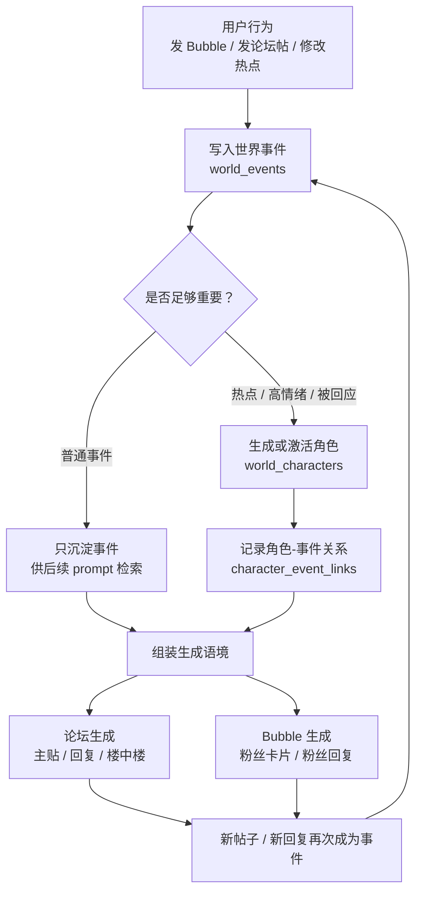

这个图表达的是：用户动作不再只是一次 prompt 输入，而是先变成“世界事件”；事件再决定是否生成 / 激活角色；角色带着自己的记忆进入下一轮论坛或 Bubble 生成。

### 8.2 数据分层

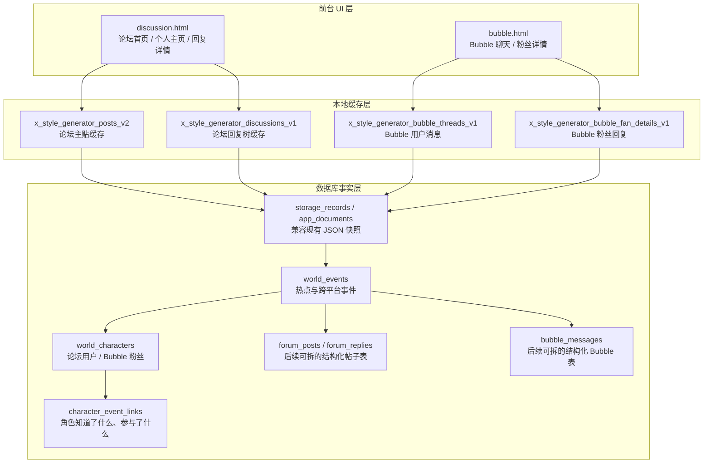

这个图表达的是：第一阶段可以继续兼容 localStorage 和 JSON 快照；但世界感相关的“事件 / 角色 / 关系”需要尽早独立出来。

### 8.3 新热点触发角色生成

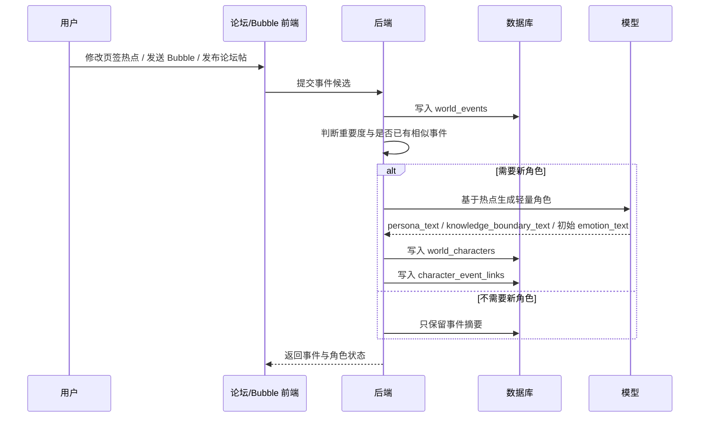

这个图表达的是：不是每次有新文本都生成角色；只有足够强的热点、情绪或互动事件，才会扩充角色池。

### 8.4 论坛生成流程

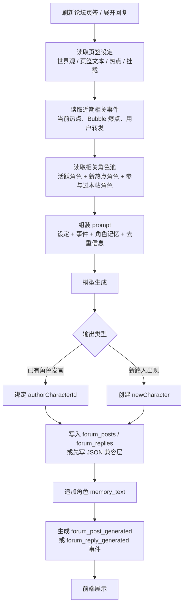

这个图表达的是：论坛生成不再只是“生成一些匿名帖子”，而是“从角色池中挑人发言，发言后反过来更新世界”。

### 8.5 Bubble 粉丝回复流程

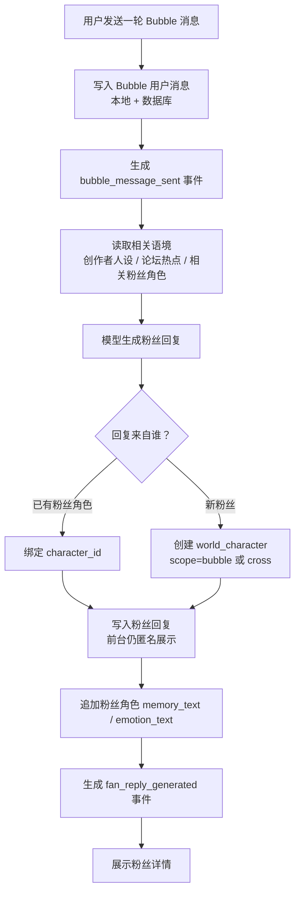

这个图表达的是：Bubble 前台依然可以像现在一样匿名、轻量；后台开始知道“这条回复是谁说的”。

### 8.6 用户疑似回复粉丝后的跨平台联动

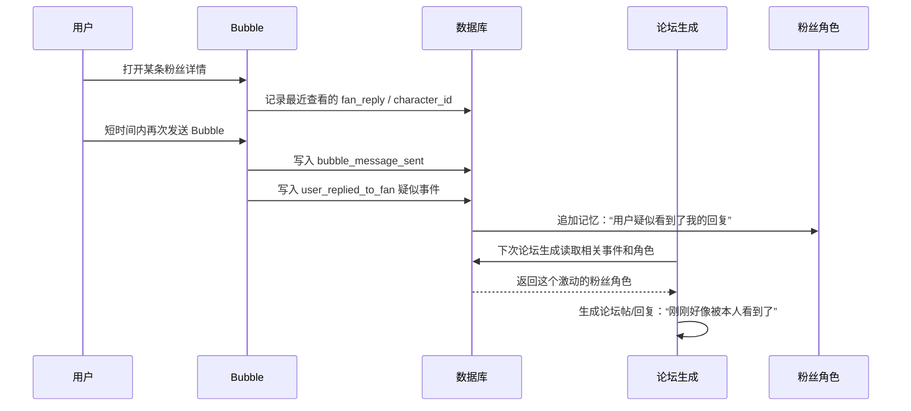

这个图表达的是：先用“疑似回应”的低成本链路制造世界联动，不必一开始就做复杂意图识别。

### 8.7 分阶段路线

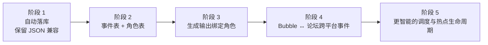

建议先做前四段，暂时不要急着做第五段。第五段会明显增加系统复杂度，最好等角色和事件链路跑顺之后再加。

## 9. 初步结论

最合适的方向不是一次性把论坛和 Bubble 改成很重的社交模拟器，而是先建立一个轻量“世界状态层”：

1. 数据先落库。
2. 热点升级为事件。
3. 论坛用户 / Bubble 粉丝升级为轻量角色。
4. 角色有完整文本记忆，但不做复杂衰退。
5. 论坛与 Bubble 通过事件和角色关联，而不是只互相挂 prompt 文本。

这样既能保留现在项目的生成速度和 UI 结构，也能逐步长出“他们真的生活在同一个世界里”的感觉。

## 10. 论坛中心版：背景卡机制（共识版）

> 这一节记录后续讨论中确认的方向：先把重心放回论坛本身。论坛优化的关键不是优先做论坛与 Bubble 的强联动，而是让同一个热点在不同信息层角色之间产生自然碰撞。

### 10.1 核心判断

论坛氛围的重点不是单纯生成更多内容，而是制造合理的信息差。

```text
论坛讨论 = 当前热点 × 背景沉淀 × 角色知道多少 × 角色如何解释
```

同一个热点下，不同角色的发言差异应该来自不同知识边界，而不是随机多样化：

- 新角色只知道眼前热点，所以容易说“单看这次还行啊”。
- 近期角色知道最近几轮讨论，所以会说“最近其实一直在吵这个点”。
- 老角色知道更久的比较基线，所以会说“你如果看过以前，就知道为什么有人觉得有落差”。
- 世界书型角色知道长期设定，但不一定知道最新论坛细节，所以会从长期路线、事业阶段、关系模式等角度解释。

### 10.2 背景卡的定位

背景卡不是世界书的替代品，而是论坛生成时的动态知识层。

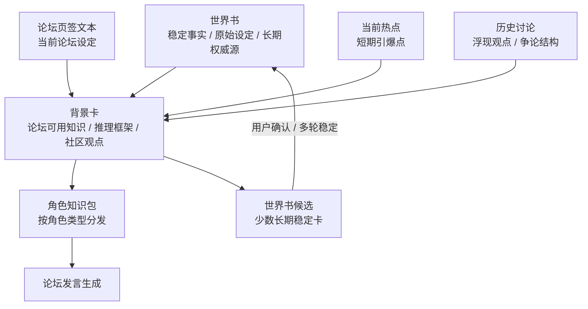

日常演化时，热点、粉丝推测、讨论框架、近期观点，主要增量更新背景卡；世界书不应该被频繁污染。世界书只承载稳定事实、长期设定、原始资料和用户明确确认的长期变化。

### 10.3 背景卡与世界书的关系

认可的原则：

- 世界书是长期事实库，不随论坛日常波动频繁更新。
- 背景卡是论坛动态知识层，用来承接热点、页签文本、世界书提炼和历史讨论。
- 背景卡是提炼后的使用层，不是唯一事实源；每张卡必须保留来源。
- 背景卡可以作为论坛生成时的主要上下文，避免每次都喂完整世界书原文。
- 少数背景卡在多轮稳定、并且接近人物长期设定时，可以成为世界书候选，但最好用户确认后再升级。

| 层级 | 作用 | 更新频率 | 示例 |
|---|---|---:|---|
| 世界书 | 稳定事实、长期设定、原始资料 | 低 | 公开行程、出道史、巡演信息、确认关系 |
| 背景卡 | 论坛可用的动态知识单元 | 高 | 粉丝推理框架、社区观点、近期争论、评价基线 |
| 角色知识包 | 某个角色实际知道哪些卡 | 每次生成动态组装 | 新角色少量卡，老角色更多旧卡 |
| 角色发言 | 带信息差的论坛文本 | 每轮生成 | 围绕同一热点产生不同判断 |

### 10.4 背景卡来源拆解

背景卡首先应该按“来源”拆，而不是只按抽象类型拆。不同来源的真实性和稳定性不同。

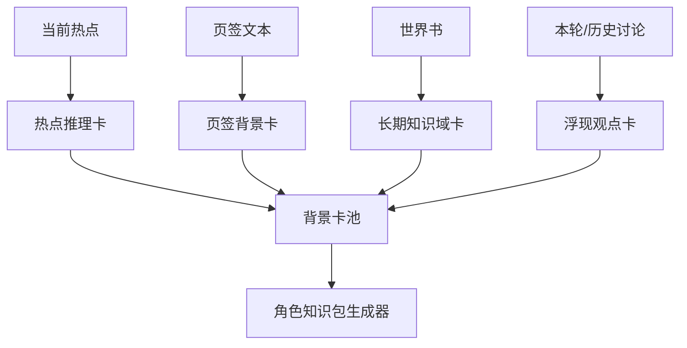

四类来源的拆法：

1. **当前热点 → 热点推理卡**
   - 记录当前引爆点里包含的推测方式、暧昧判断、短期争议。
   - 不能把推测写成事实。
   - 适合新入场角色、CP 深挖型角色、短期争论角色。

2. **页签文本 → 页签背景卡**
   - 记录当前论坛讨论区默认背景、社区氛围、活跃用户定位、当前环境。
   - 稳定性高于热点卡，低于世界书。
   - 适合大部分当前论坛角色。

3. **世界书 → 长期知识域卡**
   - 从世界书原文中提炼可分发的知识域。
   - 不把整条世界书直接给所有角色。
   - 适合老角色、事业粉、考据型角色、世界书种子型角色。

4. **本轮/历史讨论 → 浮现观点卡**
   - 记录本轮论坛里出现的新观点、反方观点、争论结构和元讨论习惯。
   - 初始状态应更保守，多轮重复后再升级。
   - 适合近期角色和老角色制造讨论连续性。

### 10.5 背景卡字段建议

背景卡第一版不需要太复杂，但必须有来源、真实性等级和适用角色，避免 AI 把粉丝推测沉淀成世界事实。

```json
{
  "id": "bg_relationship_pattern_001",
  "scope": "forum_tab:custom_xxx",
  "source_type": "hot_topic | tab_background | worldbook | forum_discussion",
  "source_id": "来源对象 ID",
  "source_excerpt": "可追溯的原文片段",
  "truth_level": "worldbook_fact | tab_setting | community_viewpoint | community_speculation | interpretation_frame | discussion_structure",
  "knowledge_domain": "relationship_pattern | career | schedule | performance | early_history | fandom_mood",
  "summary": "给 prompt 使用的一句话背景",
  "detail_text": "给老角色或深度角色使用的补充说明",
  "suitable_roles": ["old_fan", "cp_detective"],
  "status": "candidate | warm | stable | archived | worldbook_candidate",
  "mention_count": 1,
  "first_seen_at": "2026-04-20T00:00:00+08:00",
  "last_seen_at": "2026-04-20T00:00:00+08:00"
}
```

最关键的字段：

- `source_type`：说明卡来自热点、页签、世界书还是讨论。
- `source_excerpt`：保留来源，方便追溯和纠错。
- `truth_level`：区分事实、页签设定、社区观点、粉丝推测、解释框架。
- `knowledge_domain`：让角色按领域取卡，而不是随机取卡。
- `suitable_roles`：明确哪些角色可以知道，避免所有角色全知。

### 10.6 AI 的角色：候选拆解器

背景卡拆解需要 AI 做语义理解，但 AI 不应该成为世界设定裁判。

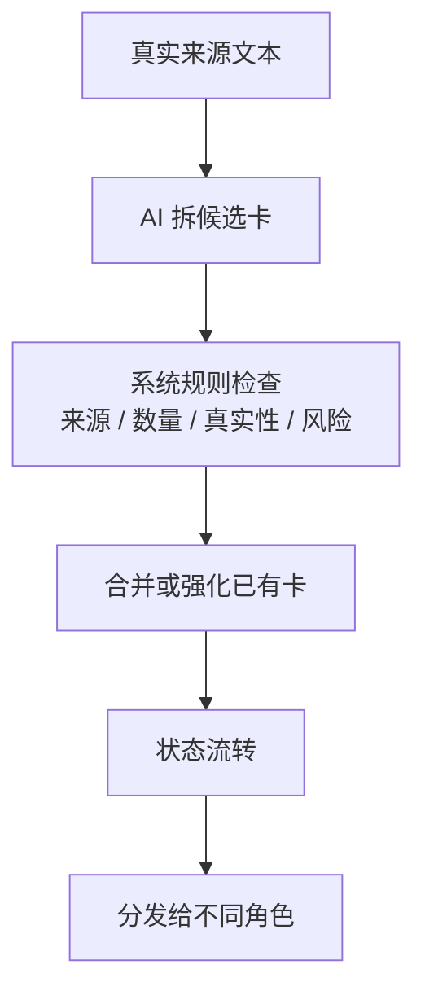

认可的边界：

- AI 负责从热点、页签、世界书、讨论中拆出候选信息单元。
- AI 可以判断卡片类型、适用角色、知识领域、是否与旧卡重复或冲突。
- AI 不直接判断关系真假、事实成立、是否升级世界书。
- 系统必须限制每轮新建卡数量，优先合并旧卡。
- 高风险卡，例如关系成立、重大设定变化、世界书升级，应进入确认流程。

Prompt 原则：

```text
你不是在判断事实真伪。
你是在提炼论坛里可复用的讨论框架。
不要把推测写成事实。
不要把部分人的观点写成全体共识。
不要输出唯一结论。
每张卡必须保留来源、真实性等级和适用角色。
```

### 10.7 角色层：不是调用多少卡，而是生成知识包

角色层不只是决定“调用几张背景卡”，而是决定调用哪些来源、哪些主题、哪些深度、哪些真实性等级的卡。

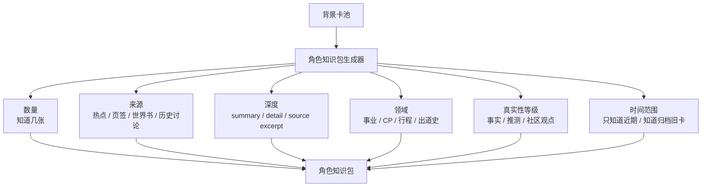

角色信息差应来自：

- 出现时间：新角色不知道旧卡，老角色可以知道归档卡。
- 角色类型：事业粉、CP 深挖型、老粉、考据型、路人型拿不同领域。
- 信息来源：世界书型角色知道某些长期知识域，但不一定知道最新讨论。
- 真实性边界：角色可以知道“这是粉丝推测”，而不是把推测当事实。
- 个人记忆：背景卡是社区知识，角色记忆是这个角色自己的发言经历和情绪积累。

### 10.8 角色知识包示例

```json
{
  "character_id": "char_old_ximilu_001",
  "role_type": "old_fan",
  "knowledge_pack": {
    "current_hot_topic": "当前热点文本",
    "known_cards": [
      {
        "id": "bg_relationship_publicity_pattern",
        "summary": "粉丝讨论里，Jessie 过往公开恋情常被描述为男方先忍不住露出痕迹，而 Jessie 本人更少主动营业恋情。",
        "truth_level": "community_viewpoint"
      },
      {
        "id": "bg_jessie_work_focus",
        "summary": "Jessie 在公开恋情后通常仍把工作放在前面，粉丝会用这一点判断她对恋情曝光的态度。",
        "truth_level": "community_viewpoint"
      },
      {
        "id": "bg_shotaro_ximilu_ambiguity",
        "summary": "将太郎因为本身表现得像西米露，导致他的互动容易被解读成粉丝反应和暧昧信号叠加。",
        "truth_level": "interpretation_frame"
      }
    ],
    "unknown_boundaries": [
      "她不知道将太郎私下是否真的和 Jessie 确认关系。",
      "她知道的是粉丝长期推理框架，不是事实证明。"
    ]
  }
}
```

### 10.9 日常更新规则

大多数情况下，只增量更新背景卡，不更新世界书。

适合进入背景卡：

- 粉丝猜测。
- CP 解读。
- 舆论分歧。
- 当前热点。
- 论坛争论方式。
- 一段时间内的社区看法。
- “很多人觉得……”。
- “有人会用……来推理……”。
- “这个论坛常常……”。
- “近期一直有人……”。

适合更新世界书：

- 新行程确认。
- 新作品确认。
- 新巡演信息。
- 人物长期设定变化。
- 关系事实被用户明确设定。
- 某个设定需要永久存在。
- 某个背景卡已经稳定到变成人物长期理解的一部分，并且用户确认。

### 10.10 当前真实数据下的启发

根据当前数据库中的论坛页签和世界书，`西米露💖` 页签适合做第一版试点，因为它已经同时具备：

- 当前热点：Jessie 与将太郎关系推测、过往恋情公开模式、将太郎西米露属性。
- 页签背景：巡演专辑主打歌高热、合作舞台打歌期、Ending 神图出圈、粉丝支持但恋情态度可分歧。
- 世界书来源：巡演信息、公开行程、Jessie 早期公开信息、Jessie 和将太郎细节。
- 角色分层空间：新西米露、老西米露、事业粉、CP 深挖型、行程状态型、出道史考据型、世界书种子型。

这说明背景卡拆解不应只从当前热点中做总结，而应同时从热点、页签文本、挂载世界书和历史讨论中提炼，再由角色知识包生成器选择性分发。

### 10.11 背景卡机制小结

最终认可的结构：

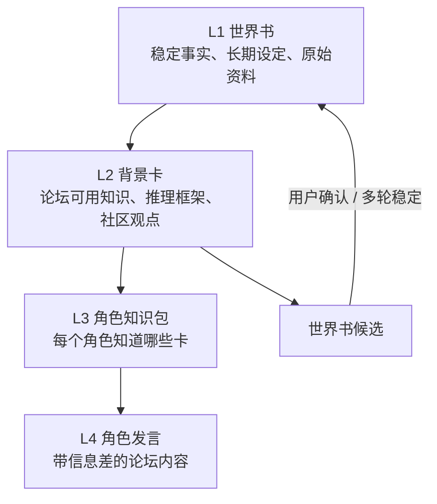

一句话总结：

> 世界书提供稳定事实，背景卡沉淀论坛认知，角色知识包制造信息差，论坛发言表现信息差。

## TODO：聊天页后续世界感增强

- 后续可以考虑让角色在聊天页里感知自己的粉丝环境、Bubble 舆论和论坛讨论氛围。
- 这一层更适合增强聊天页的连续世界感，但暂时不进入当前版本实现。
- 当前优先级仍然是先把论坛社区本身搭稳：用户粉丝页、角色粉丝页、热点碰撞和 seed 视角先跑通。
